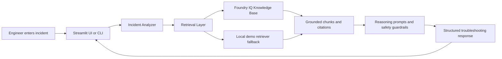

# OpsMind AI - Incident Troubleshooting and Runbook Agent

OpsMind AI is a hackathon-ready Reasoning Agent for cloud operations teams. It helps DevOps, SRE, platform, and support engineers turn messy incident reports into grounded, cited, step-by-step troubleshooting guidance.

The project is designed for the Microsoft Agents League Hackathon 2026 Reasoning Agents track and centers on Microsoft Foundry IQ as the knowledge layer.

## Why This Matters

Incident response is often slowed down by scattered runbooks, stale tribal knowledge, noisy alerts, and pressure to act quickly. OpsMind AI gives engineers a safer first response:

- identifies the likely incident category
- retrieves relevant operational knowledge from Foundry IQ
- separates diagnosis from remediation
- cites the runbooks or incident docs used
- flags risky actions that need human validation
- avoids autonomous infrastructure changes

OpsMind AI is an assistant, not an autopilot.

## Architecture



Foundry IQ is the primary retrieval source. It provides a configurable knowledge base over operational runbooks and incident documents, using agentic retrieval to plan queries, retrieve relevant information, and return grounded citations. The local fallback exists only so the hackathon demo can run before cloud setup is complete.

## Tech Stack

- Python 3.11+
- Streamlit for the lightweight UI
- Requests for Foundry IQ REST integration
- Pytest for tests
- Markdown runbooks for sample knowledge base content
- Optional Azure OpenAI or Foundry Agent Service integration for final answer synthesis

## Features

### MVP

- Incident input form with optional severity selector
- Foundry IQ retrieval abstraction
- Local markdown retrieval fallback for demos
- Structured response with summary, evidence, diagnosis, remediation, validation, risks, citations, and escalation triggers
- Confidence and risk labels
- Safety guardrails that prevent destructive autonomous action
- Sample runbook corpus and sample demo incidents

### Nice To Have

- Export response as Markdown
- Incident category tags
- Demo mode toggle
- Source quality scoring
- Recent incident history

### Stretch

- Foundry Agent Service tool integration
- Authentication-aware retrieval under the caller identity
- Jira or Azure DevOps ticket draft generation
- Post-incident summary generator
- Teams bot wrapper

## Repository Layout

```text
opsmind-ai/
  app/
    opsmind/
      analyzer.py
      cli.py
      config.py
      foundry_iq.py
      formatter.py
      local_retriever.py
      models.py
      safety.py
      ui_streamlit.py
  config/
    app.example.env
    retrieval_config.json
  docs/
    architecture.md
    implementation_plan.md
    judging_optimization.md
    kb_design.md
  demo/
    sample_incidents.json
    demo_script.md
  knowledge_base/
    runbooks/
      RB-CPU-001-linux-vm-cpu-spike.md
      RB-DISK-001-linux-disk-full.md
      RB-SSL-001-certificate-expiry.md
      RB-HTTP-001-app-502-503.md
      RB-DNS-001-resolution-failure.md
      RB-K8S-001-pod-crashloop.md
      RB-DEPLOY-001-failed-deployment.md
      RB-VM-001-azure-vm-connectivity.md
  prompts/
    answer_formatting.md
    fallback.md
    retrieval.md
    safety_guardrails.md
    system.md
  tests/
    test_analyzer.py
    test_local_retriever.py
  pyproject.toml
  requirements.txt
```

## Foundry IQ Integration

OpsMind AI expects a Foundry IQ knowledge base containing runbooks, known issue docs, postmortems, service dependency notes, and escalation policies. The integration layer is intentionally thin:

1. Build a search query from the incident text, severity, and detected category.
2. Query Foundry IQ for grounded chunks and citations.
3. Normalize returned content into `RetrievedSource` objects.
4. Generate a structured response that cites every operational recommendation.

Configure the integration with:

```bash
FOUNDRY_IQ_ENDPOINT=https://<your-endpoint>
FOUNDRY_IQ_KNOWLEDGE_BASE_ID=<knowledge-base-id>
FOUNDRY_IQ_API_KEY=<key-or-token>
FOUNDRY_IQ_API_VERSION=2025-11-01-preview
OPSMIND_RETRIEVAL_MODE=foundry
```

The exact production API shape can vary while Foundry IQ is in preview. The `FoundryIQClient` is isolated so you can adjust the request payload without rewriting the app.

## Setup

```bash
python -m venv .venv
.venv\Scripts\activate
pip install -r requirements.txt
copy config\app.example.env .env
```

For local demo mode:

```bash
python -m app.opsmind.cli "Kubernetes checkout pod is crash looping after deployment"
streamlit run app/opsmind/ui_streamlit.py
```

For Foundry IQ mode, update `.env` with your Foundry IQ settings and set:

```bash
OPSMIND_RETRIEVAL_MODE=foundry
```

## Demo Flow

1. Open the Streamlit app.
2. Select severity `High`.
3. Enter: `Checkout API is returning 502 after deployment and users cannot complete payment.`
4. Show that OpsMind retrieves app gateway and deployment runbooks.
5. Walk through the response:
   - incident summary
   - grounded evidence
   - likely diagnosis
   - safe remediation steps
   - validation checks
   - citations
   - human review warnings
6. Open one cited runbook and show the answer is grounded in source material.

## Hackathon Alignment

- Accuracy and Relevance: answers are retrieved from Foundry IQ and cite operational sources.
- Reasoning and Multi-step Thinking: the agent classifies the incident, gathers evidence, proposes diagnosis, then remediation and validation.
- Creativity and Originality: applies Foundry IQ to a high-pressure cloud operations workflow.
- User Experience and Presentation: lightweight UI, strong scenario, clear response sections.
- Reliability and Safety: no direct infrastructure execution, explicit uncertainty, escalation guidance.
- Community Vote Potential: relatable demo for anyone who has been on call.

## Safety Considerations

OpsMind AI does not execute commands, restart services, delete resources, rotate secrets, change firewall rules, or modify infrastructure. It only recommends steps. Any high-risk action is flagged for human review.

The agent should say when evidence is insufficient and should not invent runbook steps without citations.

## Future Improvements

- Connect to Foundry Agent Service as a first-class agent tool.
- Add identity-aware retrieval for enterprise permission boundaries.
- Add incident timeline ingestion from alerts and logs.
- Add post-incident report drafting.
- Add action approval workflow for controlled automation.

## Screenshots

Add screenshots before submission:

- `demo/assets/home-screen.png`
- `demo/assets/incident-response.png`
- `demo/assets/citations.png`

